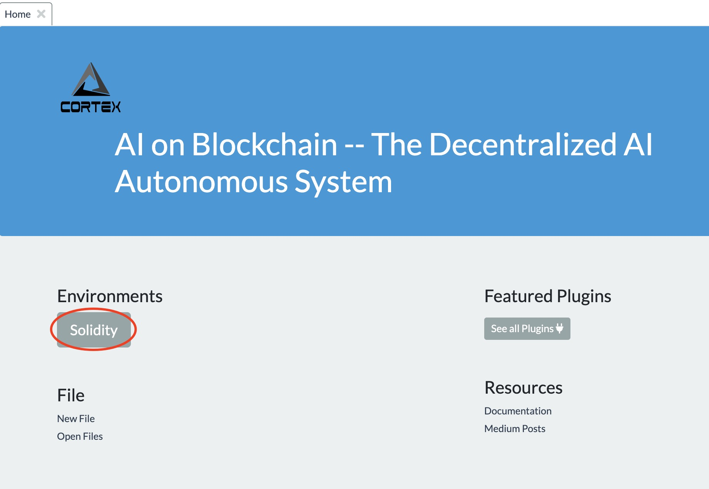
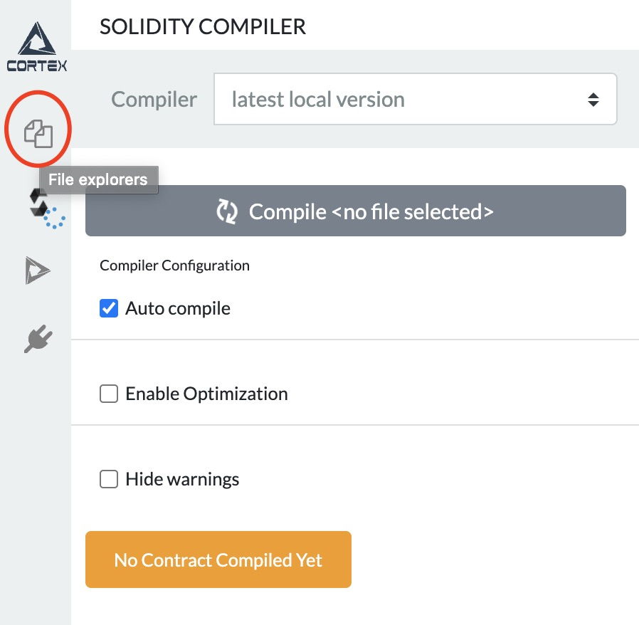
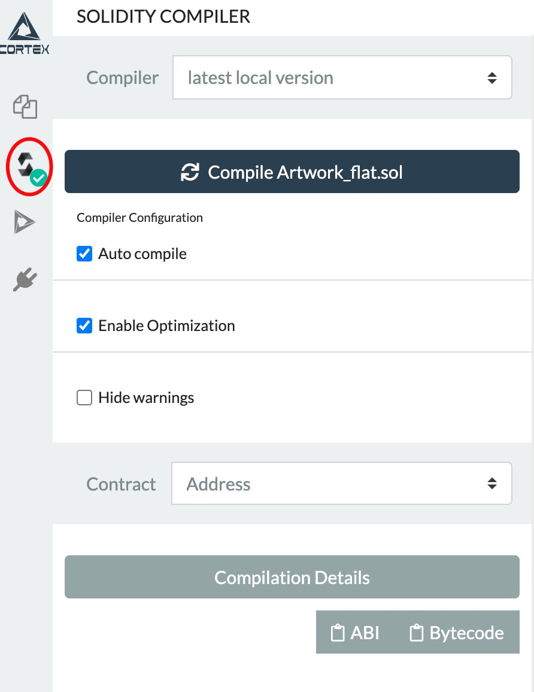
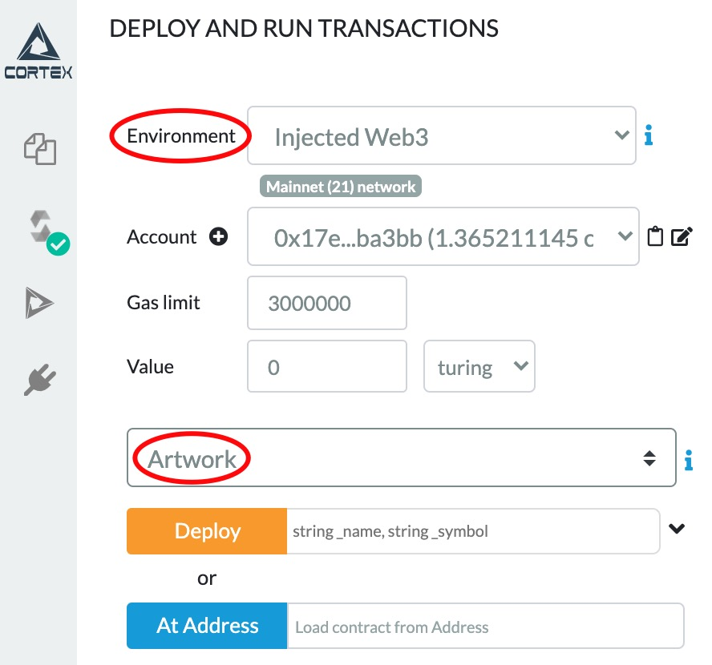
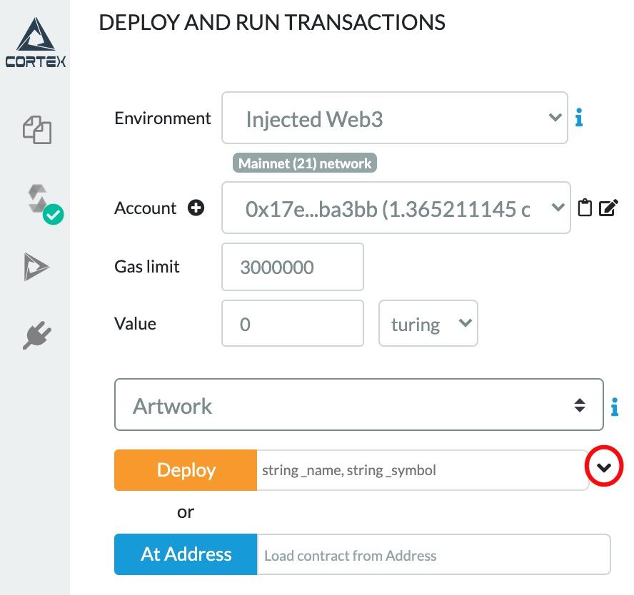
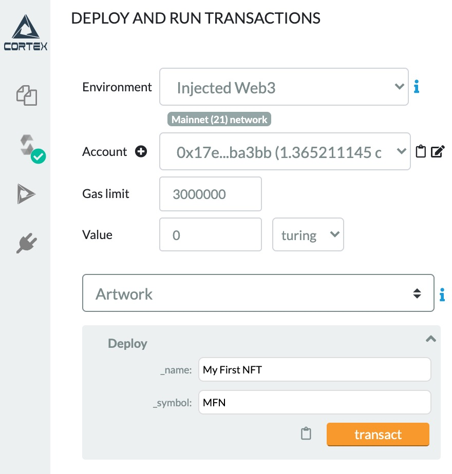
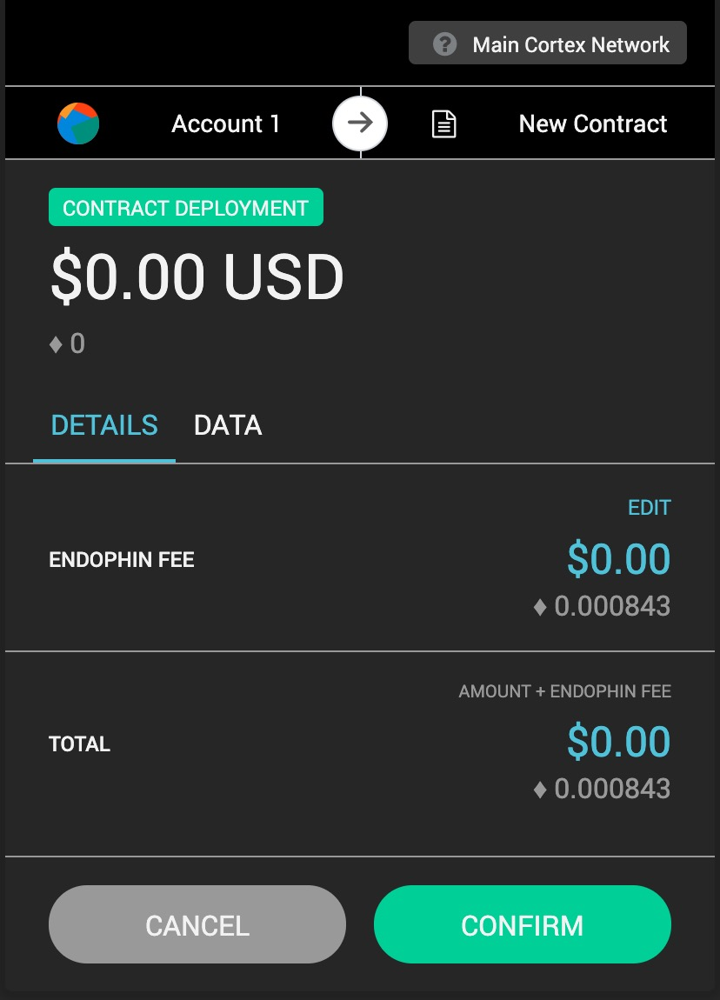
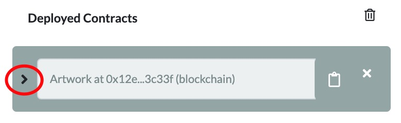
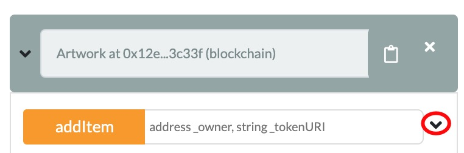

## Upload metadata to IPFS
follow the [instruction](https://docs.ipfs.io/install/command-line/) to install **IPFS** on your machine.

Run your own IPFS node:
```
ipfs daemon
```
Open a new tab, goto the directory where the NFT image (*example.jpg*) is located, upload it to IPFS:
```
ipfs add example.jpg
```
Terminal will output something like: 
```
added QmcoxJV7ypCFDPhjiHUxeUw4g9Sy6uULiJKrgpFphh6jbG example.jpg
```
Create a metadata file (*metadata.json*) with the NFT's information and the image hash from last step (`QmcoxJV7ypCFDPhjiHUxeUw4g9Sy6uULiJKrgpFphh6jbG`):
```
{
    "title": "Asset Metadata",
    "type": "object",
    "properties": {
        "name": {
            "type": "string",
            "description": "Demo NFT"
        },
        "description": {
            "type": "string",
            "description": "This NFT is created for demonstration"
        },
        "author" : {
            "type": "string",
            "description":"Cortex"
        },
        "image": {
            "type": "string",
            "description": "https://ipfs.io/ipfs/QmcoxJV7ypCFDPhjiHUxeUw4g9Sy6uULiJKrgpFphh6jbG"
        }
    }
}

```
Upload the metadata to IPFS:
```
ipfs add metadata.json
```
You will get the hash for this file (`QmbLJJHKFNmvwFq475iYCCAw8vvBwhRqSqLgEVztmpUDAr`).

## Create NFT token contract
Clone this repository, and create a new smart contract file (*Artwork.sol*) under the *contract* directory:
```
pragma solidity ^0.4.24;

import "./CRC4/CRC4Full.sol";
import "./utils/Counters.sol";
import "./utils/Ownable.sol";

contract Artwork is CRC4Full, Ownable {
    using Counters for Counters.Counter;
    Counters.Counter private _tokenIds;

    constructor(string memory _name, string memory _symbol) 
        CRC4Full(_name, _symbol) public 
    {}

    function addItem(address _owner, string memory _tokenURI) public onlyOwner returns (uint256) {
        _tokenIds.increment();

        uint256 newItemId = _tokenIds.current();
        _mint(_owner, newItemId);
        _setTokenURI(newItemId, _tokenURI);

        return newItemId;
    }
}
```

## Deploy to the blockchain
##### Note: deploying smart contract through Remix require you to have [Cortex wallet extension](https://raw.githubusercontent.com/CortexFoundation/Cortex_Release/master/cortex-wallet/CortexWallet.zip) installed on Chrome browser, also make sure you have enough CTXC for paying the endorphin fees.
Goto https://cerebro.cortexlabs.ai/remix, click on the **Solidity** environment


Then select the **File Explorers** icon


Adding our smart contract file *Artwork.sol* and all the files it is inherited from can be troublesome. To simply this process, we have created a flatten version of *Artwork.sol* in this repository, named *Artwork_flat.sol*, add this file to Remix and select it.
Select the **Solidity Compiler** icon then click **Compile Arwork_flat.sol**


Select the **Deploy and run transactions** icon, make sure you have the right environment and contract selected


Extend the deployment box by clicking on the little downward arrow on the right


Type in the name and the symbol for your NFT token, for example, *My First NFT* (*MFN*). Click on the **transact** button to deploy the contract to the blockchain:


A window will pop up asking for confirmation, click confirm


## Mint the artwork
You will be able to see the deployed contract after successfully deploying it to the network. Click on the little arrow on the left to expend the content


Find the **addItem** function


put your **wallet address** as the owner. The format for tokenURI:
```
https://ipfs.io/ipfs/[metadata_hash]
```
e.g. for previous metadata.json file in this guide, `https://ipfs.io/ipfs/QmbLJJHKFNmvwFq475iYCCAw8vvBwhRqSqLgEVztmpUDAr`
Again, like deploying the contract, click on **transact** to send the transaction.

When the transaction is confirmed, you now have successfully created your first NFT on Cortex blockchain, you can find your CRC4 token on [Cerebro](https://cerebro.cortexlabs.ai/#/CRC4tokens) explorer.